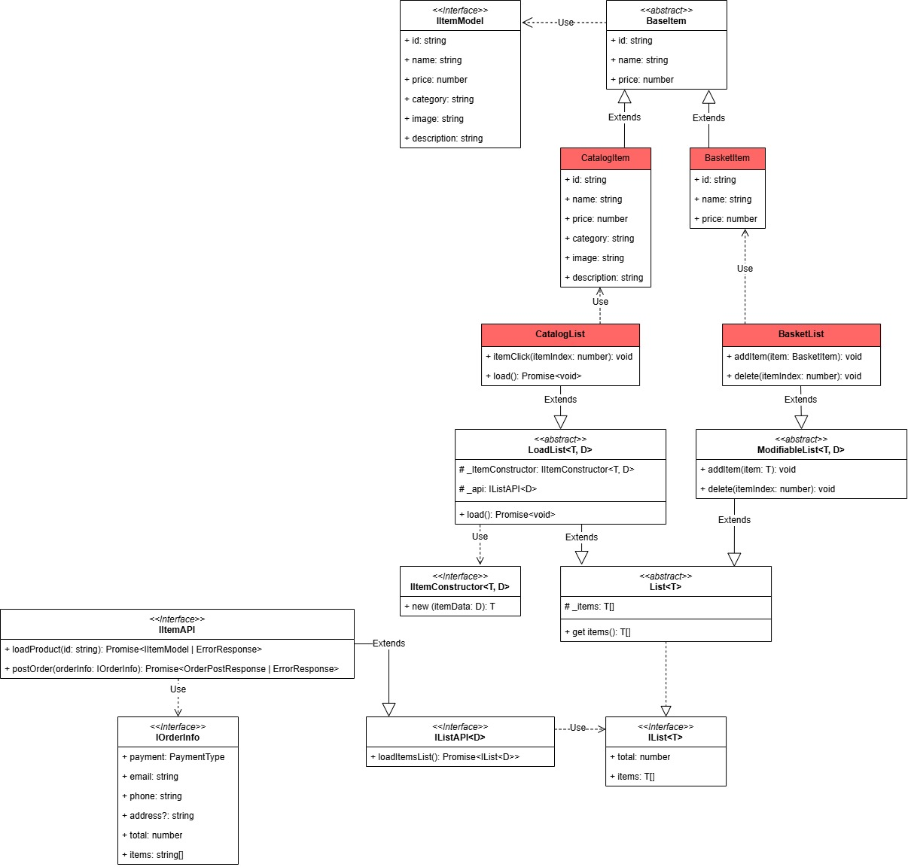
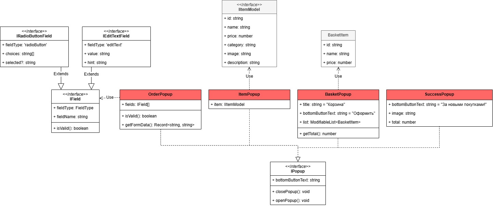

# Проектная работа "Веб-ларёк"
Стек: HTML, SCSS, TS, Webpack

Структура проекта:

src/ — исходные файлы проекта
src/components/ — папка с JS компонентами
src/components/base/ — папка с базовым кодом

Важные файлы:

src/pages/index.html — HTML-файл главной страницы
src/types/index.ts — файл с типами
src/index.ts — точка входа приложения
src/scss/styles.scss — корневой файл стилей
src/utils/constants.ts — файл с константами
src/utils/utils.ts — файл с утилитами

# Установка и запуск
Для установки и запуска проекта необходимо выполнить команды

```
npm install
npm run start
```

или

```
yarn
yarn start
```

# Сборка

```
npm run build
```

или

```
yarn build
```

# Архитектура проекта
## 1 Представление товаров


```IItemModel``` - интерфейс, представляющий поля с полной информацией о каждом товаре.

```BaseItem``` принимает в конструкторе объект IItemModel и инициализирует поля с базовой информацией о товаре - ```id```, ```itemName```, ```price```.

Для представления товаров в каталоге и корзине используются классы ```CatalogItem``` и ```BasketItem```. ```CatalogItem``` дополняет ```BaseItem``` полной информацией о товаре - ```image```, ```description```, ```type```.

## 2 Типы для списков
В проекте представлено две сущности-списка: каталог товаров и корзина с товарами.
```IList<T>``` - базовый интерфейс для описания списка. Содержит поля 
```total``` для количества элементов списка и ```items``` - массив элементов ```T```.

```IListAPI<D>``` - интерфейс, описывающий API для получения элементов списка с сервера с помощью метода ```loadItemsList```, который возвращает элементы в виде объекта IList<D>.

```IItemAPI``` - интерфейс, наследующий ```IListAPI<IItemModel>```, который содержит дополнительные методы работы с конкретным API сервера из данного проекта:
- ```loadProduct``` - возвращает объект ```IItemModel``` товара по его ```id```, либо объект ```ErrorResponse``` с полем ошибки ```error```.
- ```postOrder``` - метод отправки заказа на сервер в виде объекта ```IOrderInfo```, содержащем ```id``` товаров в массиве ```items``` и информацию об оплате и доставке.

```List<T>``` - абстрактный класс, реализующий ```IList<T>```. Обеспечивает инкапсуляцию списка ```items``` с помощью защищёного списка ```_items``` и геттера для ```items```.

```LoadList<T, D>``` - абстрактный класс, наследующий List<T>. Представляет класс списка, который загружает свои элементы из ```_api``` с помощью метода ```load```. Преобразует данные, полученные в виде объектов типа ```D```, в объекты типа ```T``` с помощью класса ```_ItemConstructor```, реализующий интерфейс ```IItemConstructor<T, D>```.

```ModifiableList<T>``` - абстрактный класс, наследующий ```List```. Представляет модифицируемый список с методами добавления элемента ```addItem``` и удаления по индексу ```delete```.

```CatalogList``` - класс, представляющий список товаров в каталоге. Наследует класс ```LoadList<CatalogItem, IItemModel>```. Предоставляет метод загрузки товаров ```load``` и содержит метод ```itemClick```, обрабатывающий клик по карточке товара.

```BasketList``` - класс, представляющий список товаров в корзине. Наследует ModifiableList<BasketItem, IItemModel>. Предоставляет методы ```addItem``` и ```delete``` добавления товара и удаления по индексу соответственно.

## 3 Типы для поп-апов


```IPopup``` - базовый интерфейс для поп-апов, содержит поле ```bottomButtonText``` для текста кнопки поп-апа и функции ```closePopup``` и ```openPopup``` для закрытия и открытия поп-апа

```OrderPopup``` - класс поп-апов с информацией о заказе - оплате и доставке. Содержит поля ```fields```, метод валидации ```isValid``` и ```getFormData``` для получения объекта ```Record<string, string>```, содержащего значения полей.

```IField``` - базовый интерфейс для полей поп-апа информации о заказе. Определяет поля ```fieldType``` - тип поля, ```fieldName``` - название поля, ```isValid``` - метод валидации.

```IRadioButtonField``` - интерфейс поля с выбором одного варианта. Определяет поле ```fieldType``` и содержит поля ```choices``` с вариантами и ```selected``` - выбранный вариант.

```IEditTextField``` - интерфейс поля с вводом текста. Определяет поле ```fieldType``` и содержит поля ```value``` для хранения введённого текста и ```hint``` - для подсказки в поле ввода. 

```ItemPopup``` - класс поп-апа с информацией о товаре. Имеет поле ```Item``` для объекта IItemModel с информацией о товаре. 

```BasketPopup``` - класс для поп-апа с корзиной. Содержит поля ```title``` - заголовок поп-апа, переменную ```list``` для объекта списка товаров и метод getTotal для стоимости заказа. 

```SuccessPopup``` - класс поп-апа с информацией об успешном оформлении покупки. Содержит поля ```image``` для расположения картинки и ```total``` для стоимости заказа.